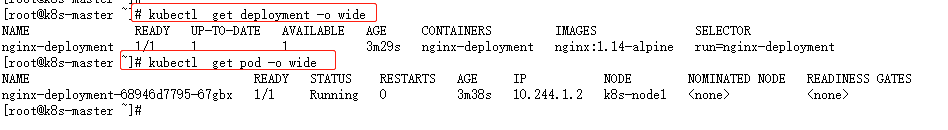
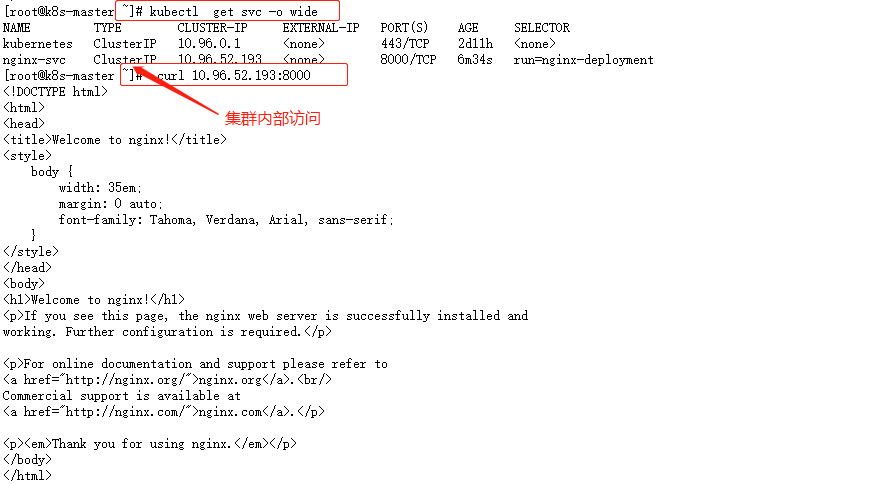
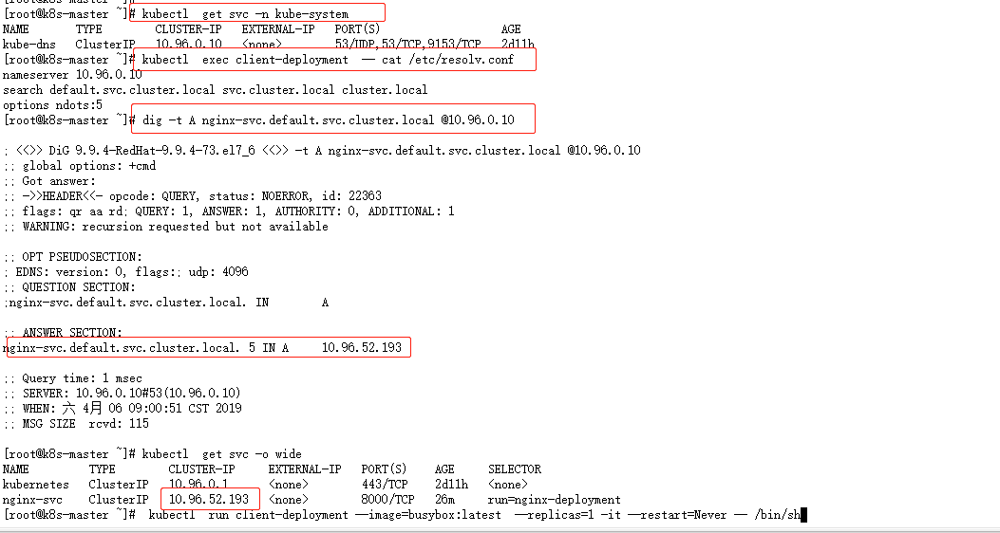
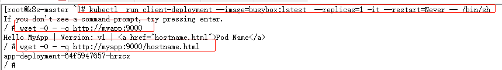
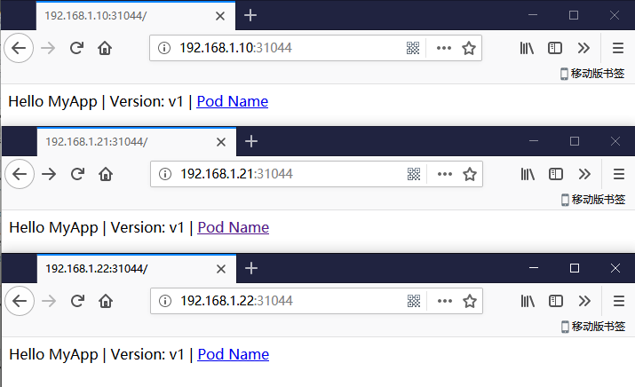

## 创建第一个Pod应用

**创建一个pod应用**
```
~]# kubectl  run nginx-deployment --image=nginx:1.14-alpine --port=80 --replicas=1 --dry-run=true
```
- Pod控制器的名称：`nginx-deployment`
- Pod向外暴露的端口：`--port`


> pod只能在k8s节点网络(集群内部)进行访问
```
[root@k8s-master ~]# curl 10.244.1.2
[root@k8s-node1 ~]# curl 10.244.1.2
[root@k8s-node2 ~]# curl 10.244.1.2
```

**Service在集群内部为Pod提供一个固定访问的入口**
> 有了service，我们可以通过域名解析，给ppod提供一个固定访问端点
```
]# kubectl  expose deployment nginx-deployment --name=nginx-svc --port=8000 --target-port=80 --protocol=TCP
```
- 将nginx-deployment上的pod创建为一个服务：`expose deployment nginx-deployment`
- Service的服务名称：`--name`
- Service的端口：`--port`
- pod的端口：`--target-port`


> 有了service我们的pod客户端（`client-deployment`）可以基于kube-dns通过域名对pod集群进行访问

```
[root@k8s-master ~]# kubectl  run client-deployment --image=busybox:latest  --replicas=1 -it --restart=Never -- /bin/sh
/ # wget -O - -q http://nginx-svc:8000/
```

## 动态缩减
```
~]# kubectl  run app-deployment --image=ikubernetes/myapp:v1  --port=80 --replicas=2
~]# kubectl   expose deployment app-deployment --name=myapp --port=9000 --target-port=80
```


- `scale`：将app-deployment控制器先的pod扩展为5个
```
~]# kubectl  scale --replicas=5 deployment app-deployment
```

- `set image`：滚动升级
```
~]# kubectl  set image deployment app-deployment app-deployment=ikubernetes/myapp:v2
~]# kubectl  rollout status deployment app-deployment # 查看更新状态
```

- `rillout`：回滚
```
~]# kubectl  rollout undo deployment app-deployment
```

## Service 暴露给外部节点访问

前面我们一直学习pod在集群内部的访问方式，如果我们想在集群外部访问，我们需要集群类型：`ClusterIP`为`NodePort`
```
~]# kubectl  edit svc myapp
  type: NodePort
~]# kubectl  get svc|grep myapp
  myapp        NodePort    10.107.222.210   <none>        9000:31044/TCP   25m
```

