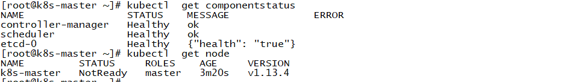
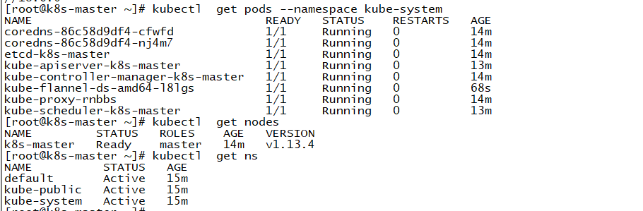
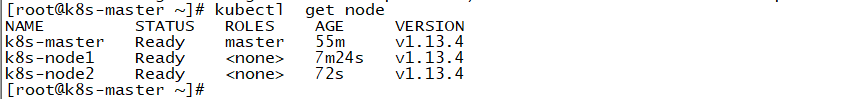

## hosts解析

```
192.168.1.10 k8s-master master
192.168.1.21 k8s-node1 node1
192.168.1.22 k8s-node2 node2
```

##  关闭防火墙、selinux、swap

```
~]# for i in stop disable ;do systemctl $i firewalld; done
~]# swapoff -a && sed -i 's/.*swap.*/#&/' /etc/fstab
~]# setenforce 0 &&  sed -i "s/^SELINUX=permissive/SELINUX=disabled/g" /etc/selinux/config  
```

## 时间同步

```
~]# yum install chrony –y
~]# systemctl enable chronyd.service && systemctl start chronyd.service && systemctl status chronyd.service
~]# chronyc sources
# crontab  -l
* * * * * /usr/sbin/ntpdate ntp.aliyun.com &> /dev/null
```


## 配置kubernetes仓库

```
~]# cat <<EOF > /etc/yum.repos.d/kubernetes.repo
[kubernetes]
name=Kubernetes
baseurl=https://mirrors.aliyun.com/kubernetes/yum/repos/kubernetes-el7-x86_64/
enabled=1
gpgcheck=1
repo_gpgcheck=1
gpgkey=https://mirrors.aliyun.com/kubernetes/yum/doc/yum-key.gpg https://mirrors.aliyun.com/kubernetes/yum/doc/rpm-package-key.gpg
EOF
```

## 配置docker仓库

```
~]# yum remove docker docker-client docker-client-latest docker-common docker-latest docker-latest-logrotate docker-logrotate docker-engine
~]# yum install -y yum-utils device-mapper-persistent-data lvm2
~]# yum-config-manager --add-repo https://download.docker.com/linux/centos/docker-ce.repo
```

## 安装程序包

```
~]# yum install -y docker-ce-18.06.0.ce-3.el7   kubelet kubeadm kubectl
```

## 配置镜像加速器

```
~]# sudo mkdir -p /etc/docker
~]# sudo tee /etc/docker/daemon.json <<-'EOF'
{
  "registry-mirrors": ["https://o4uba187.mirror.aliyuncs.com"]
}
~]# systemctl daemon-reload
~]# for i in start enable ;do systemctl $i docker ; done
```

## 设置kubelet开机自启,不需要手动启动

```
~]# vim /etc/sysconfig/kubelet
KUBELET_EXTRA_ARGS="--fail-swap-on=false"
~]# systemctl  enable kubelet
```

## kubeadm images 获取

1、查看所需要的镜像 `kubeadm config images list`
```
k8s.gcr.io/kube-apiserver:v1.13.4
k8s.gcr.io/kube-controller-manager:v1.13.4
k8s.gcr.io/kube-scheduler:v1.13.4
k8s.gcr.io/kube-proxy:v1.13.4
k8s.gcr.io/pause:3.1
k8s.gcr.io/etcd:3.2.24
k8s.gcr.io/coredns:1.2.6
```

```
~]# kubeadm config images list > images
~]# cat pull.sh 
#!/bin/bash
#
for i in $(cat ./images) ;do
    name=$(echo $i | awk -F '/' '{print $NF}')
    docker pull registry.cn-hangzhou.aliyuncs.com/dengyou/$name
    docker tag  registry.cn-hangzhou.aliyuncs.com/dengyou/$name $i
    docker rmi  registry.cn-hangzhou.aliyuncs.com/dengyou/$name
done
```

## 调整内核参数

```
~]# echo 1 > /proc/sys/net/bridge/bridge-nf-call-iptables
~]# echo 1 > /proc/sys/net/bridge/bridge-nf-call-ip6tables
```


## 初始化master节点

```
[root@k8s-master ~]# kubeadm init  --kubernetes-version=v1.13.4 --pod-network-cidr=10.244.0.0/16 --service-cidr=10.96.0.0/12 --ignore-preflight-errors=Swap
[root@k8s-master ~]# mkdir -p $HOME/.kube
[root@k8s-master ~]# sudo cp -i /etc/kubernetes/admin.conf $HOME/.kube/config
[root@k8s-master ~]# sudo chown $(id -u):$(id -g) $HOME/.kube/config
```
记录生成的join信息：` kubeadm join 192.168.1.10:6443 --token 82m7cb.28dzysfxnfzupwfm --discovery-token-ca-cert-hash sha256:141b3d66d3d9190ff46afcf3567dc96b4526d4a3c168653ad3b39ba63048e359`



## 部署 Pod 网络（`Fannel`）需要在所有节点

```
[root@k8s-master ~]# docker pull registry.cn-hangzhou.aliyuncs.com/dengyou/flannel:v0.11.0-amd64
[root@k8s-master ~]# docker tag registry.cn-hangzhou.aliyuncs.com/dengyou/flannel:v0.11.0-amd64 quay.io/coreos/flannel:v0.11.0-amd64
[root@k8s-master ~]# docker rmi registry.cn-hangzhou.aliyuncs.com/dengyou/flannel:v0.11.0-amd64
[root@k8s-master ~]# kubectl apply -f https://raw.githubusercontent.com/coreos/flannel/master/Documentation/kube-flannel.yml

```


## 部署node节点

获取镜像

```
[root@k8s-master ~]# docker save k8s.gcr.io/kube-apiserver:v1.13.4 k8s.gcr.io/kube-controller-manager:v1.13.4 k8s.gcr.io/kube-scheduler:v1.13.4 k8s.gcr.io/kube-proxy:v1.13.4 k8s.gcr.io/pause:3.1 k8s.gcr.io/etcd:3.2.24 k8s.gcr.io/coredns:1.2.6 quay.io/coreos/flannel:v0.11.0-amd64  -o master-components-imgs.gz
[root@k8s-master ~]# scp master-components-imgs.gz  k8s-node1:/root/
[root@k8s-master ~]# scp master-components-imgs.gz  k8s-node2:/root/
```

- 加入集群

```
[root@k8s-node1 ~]# docker load < master-components-imgs.gz
[root@k8s-node1 ~]# kubeadm join 192.168.1.10:6443 --token 82m7cb.28dzysfxnfzupwfm --discovery-token-ca-cert-hash sha256:141b3d66d3d9190ff46afcf3567dc96b4526d4a3c168653ad3b39ba63048e359
[root@k8s-node2 ~]# docker load < master-components-imgs.gz
[root@k8s-node2 ~]# kubeadm join 192.168.1.10:6443 --token 82m7cb.28dzysfxnfzupwfm --discovery-token-ca-cert-hash sha256:141b3d66d3d9190ff46afcf3567dc96b4526d4a3c168653ad3b39ba63048e359
```




