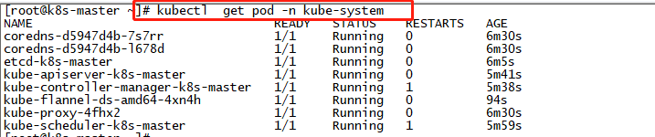
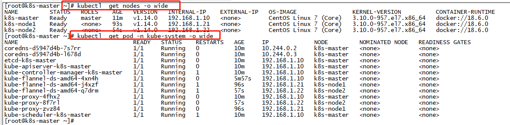

## 环境准备

- **主机名解析**
- **关闭防火墙**：`for i in stop disable ;do systemctl $i firewalld; done`
- **关闭selinux**：`setenforce 0 &&  sed -i "s/^SELINUX=permissive/SELINUX=disabled/g" /etc/selinux/config `
- **时间同步**：`systemctl enable chronyd.service && systemctl start chronyd.service && systemctl status chronyd.service && chronyc sources `
- **关闭Swap分区**：`swapoff -a && sed -i 's/.*swap.*/#&/' /etc/fstab`

## 配置Kubernetes仓库
```
~]# cat <<EOF > /etc/yum.repos.d/kubernetes.repo
[kubernetes]
name=Kubernetes
baseurl=https://mirrors.aliyun.com/kubernetes/yum/repos/kubernetes-el7-x86_64/
enabled=1
gpgcheck=1
repo_gpgcheck=1
gpgkey=https://mirrors.aliyun.com/kubernetes/yum/doc/yum-key.gpg https://mirrors.aliyun.com/kubernetes/yum/doc/rpm-package-key.gpg
EOF
```

## 配置docker仓库
```
~]# yum remove docker docker-client docker-client-latest docker-common docker-latest docker-latest-logrotate docker-logrotate docker-engine
~]# yum install -y yum-utils device-mapper-persistent-data lvm2
~]# yum-config-manager --add-repo https://download.docker.com/linux/centos/docker-ce.repo
```

## 安装程序包
```
~]# yum install -y docker-ce-18.06.0.ce-3.el7   kubelet kubeadm kubectl
```

## 配置docker
```
~]# mkdir  /etc/docker
~]# cat > /etc/docker/daemon.json <<EOF
{
  "registry-mirrors": ["https://o4uba187.mirror.aliyuncs.com"],
  "exec-opts": ["native.cgroupdriver=systemd"],
  "log-driver": "json-file",
  "log-opts": {
    "max-size": "100m"
  },
  "storage-driver": "overlay2",
  "storage-opts": [
    "overlay2.override_kernel_check=true"
  ]
}
EOF
~]# mkdir -p /etc/systemd/system/docker.service.d
```

## 配置内核参数
```
~]# modprobe overlay
~]# modprobe br_netfilter
~]# cat > /etc/sysctl.d/99-kubernetes-cri.conf <<EOF
net.bridge.bridge-nf-call-iptables  = 1
net.ipv4.ip_forward                 = 1
net.bridge.bridge-nf-call-ip6tables = 1
EOF
~]# sysctl --system
```

## 启动程序
```
 ~]# systemctl  daemon-reload
 ~]# for i in enable start ;do systemctl $i docker;done
 ~]# systemctl  enable kubelet
 ```

## 初始化master节点
```
~]# kubeadm init  --kubernetes-version=v1.14.0 --pod-network-cidr=10.244.0.0/16 --service-cidr=10.96.0.0/12  --image-repository registry.cn-hangzhou.aliyuncs.com/google_containers --ignore-preflight-errors=Swap
~]# mkdir -p $HOME/.kube
~]# cp -i /etc/kubernetes/admin.conf $HOME/.kube/config
~]# chown $(id -u):$(id -g) $HOME/.kube/config
```

## 部署网络插件[fannel](https://github.com/coreos/flannel)
```
~]# wget https://raw.githubusercontent.com/coreos/flannel/master/Documentation/kube-flannel.yml
~]# docker pull quay.io/coreos/flannel:v0.11.0-amd64
~]# kubectl  apply -f kube-flannel.yml
```


## 部署Node节点
```
~]# kubeadm join 192.168.1.10:6443 --token fukt2w.1whv7qvwv4574s9r \
     --discovery-token-ca-cert-hash sha256:7eb59d5c916f4da5dca3371b78d7a3cc7ebb72e4d3f4c61a9dea6ee4ccc6a1dc
```

